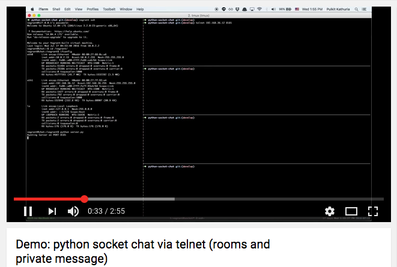

# Demo

[](https://www.youtube.com/watch?v=Vj3tT0oUe0s)


# Local Env Setup (vagrant)

* Vagrant
    * http://www.vagrantup.com/downloads.html
* VirtualBox
    * https://www.virtualbox.org/wiki/Downloads
* Ansible
    * http://docs.ansible.com/ansible/

```
vagrant box add precise64 http://files.vagrantup.com/precise64.box
```

```
vagrant up --provision
vagrant ssh
//password: vagrant
```

From Terminal (Mac/vagrant with same subnet)

```
$ telnet 192.168.36.12 8181
```


# Own Mac?

## Dependencies:

* Python V >= __2.7

## Server

```
$ python server.py
```

From Terminal

```
$ telnet 127.0.0.1 8181
$ telnet 127.0.0.1 <port>
```